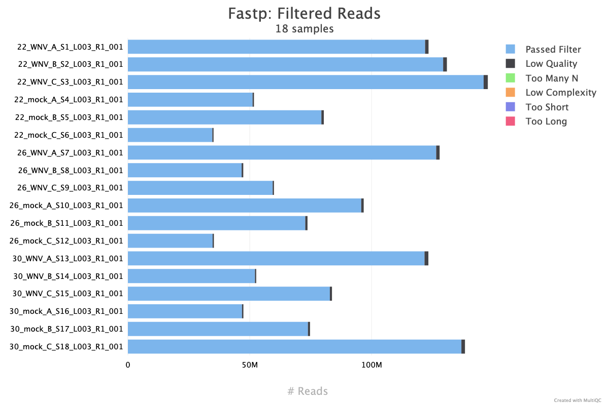

# 1 trimming and filtering
1. Fastp version 
2. Deduplication conducted here. 

## multiqc figures and tables

Number of samples: 18

**Metrics:**
- % Duplication - Duplication rate before filtering
- Reads After Filtering - Total reads after filtering (millions)
- GC content - GC content after filtering
- % PF - Percent reads passing filter
- % Adapter - Percentage adapter-trimmed reads

|Sample Name|% Duplication|Reads After Filtering|GC content|% PF|% Adapter|
|---|---|---|---|---|---|
|22_WNV_A_S1_L003_R1_001|52.02|121.94|51.04|98.85|54.77|
|22_WNV_B_S2_L003_R1_001|51.65|129.35|49.87|98.81|53.87|
|22_WNV_C_S3_L003_R1_001|57.78|145.96|50.24|98.80|45.31|
|22_mock_A_S4_L003_R1_001|49.06|51.16|52.04|98.90|60.76|
|22_mock_B_S5_L003_R1_001|56.98|79.39|52.68|98.75|45.11|
|22_mock_C_S6_L003_R1_001|61.96|34.65|57.66|98.56|32.31|
|26_WNV_A_S7_L003_R1_001|56.07|126.49|51.59|98.89|42.44|
|26_WNV_B_S8_L003_R1_001|63.90|46.67|56.52|98.57|34.81|
|26_WNV_C_S9_L003_R1_001|55.02|59.40|51.69|99.10|47.60|
|26_mock_A_S10_L003_R1_001|59.64|95.74|51.50|98.94|47.37|
|26_mock_B_S11_L003_R1_001|64.93|72.78|54.00|98.74|38.66|
|26_mock_C_S12_L003_R1_001|61.36|34.76|58.29|98.49|30.84|
|30_WNV_A_S13_L003_R1_001|56.93|121.70|51.37|98.71|51.53|
|30_WNV_B_S14_L003_R1_001|52.44|52.13|51.17|99.00|57.05|
|30_WNV_C_S15_L003_R1_001|57.56|82.87|50.71|98.95|54.34|
|30_mock_A_S16_L003_R1_001|60.29|46.81|51.83|98.77|45.36|
|30_mock_B_S17_L003_R1_001|63.33|73.87|51.90|98.83|48.93|
|30_mock_C_S18_L003_R1_001|60.95|136.83|49.60|98.93|50.30|

----------------------

## References

1. Fastp ref
2. Multiqc ref

